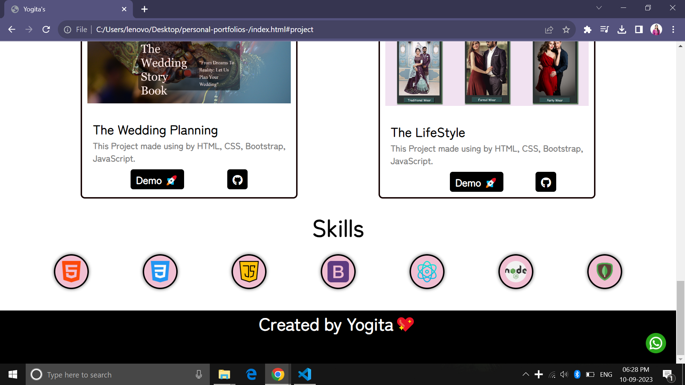

# [Yogita's Portfolio]()💡 
## Hello, Welcome to My Portfolio 🤗

I have successfully crafted a personal portfolio using HTML5 and CSS3, ensuring its full responsiveness across a variety of screens. 🌈😀🎨

<!-- OL -->
## Features

1. Hosted On Netlify
1. Smoothly Navigated
1. Responsive Design
1. This is my Github Hosted Project

# Home Page

# About Page

# Project Page

# Skills Page

